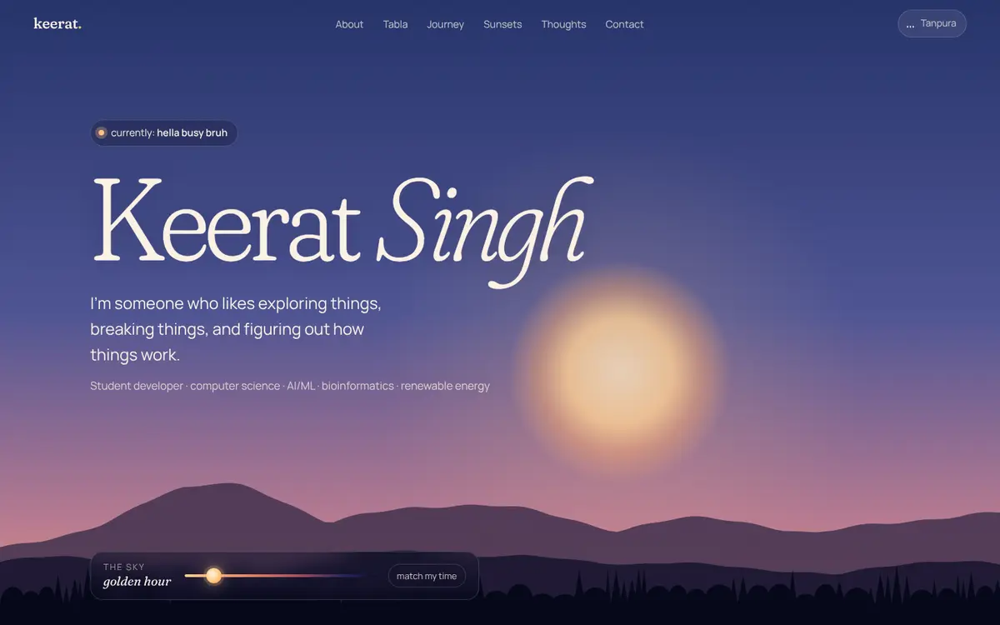
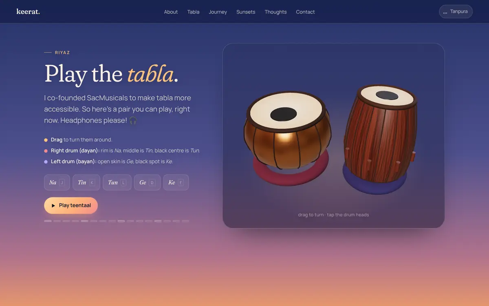
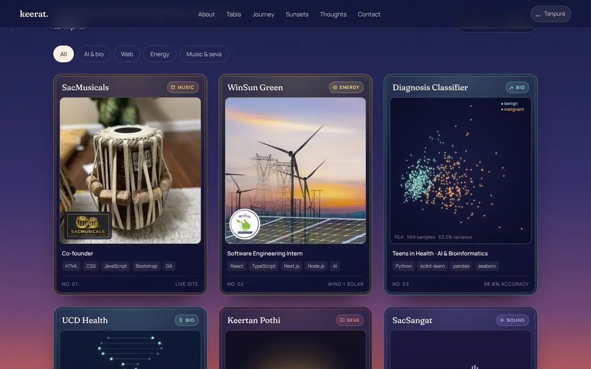

# keerat.fyi

My personal website. It's one long scroll through an evening: the page opens at golden hour, and the sky gets darker as you go down until it's night by the time you reach the bottom.

**Live:** [www.keerat.fyi](https://www.keerat.fyi)



---

## About Me

I'm a high school student interested in computer science, AI/ML, bioinformatics, and renewable energy. I like exploring things, breaking things, and figuring out how things work.

I wanted this site to show what I'm working on and also what I'm into: sunsets, tabla and kirtan, Pokémon, and philosophy.

---

## What's on the Site

- **A sky that follows my clock.** The colors match the current time where I am. You can drag the sky slider to move the sun down into night.
- **A tabla you can play.** It's a 3D pair you can drag to turn around and tap to play. Different spots on the drum heads play different strokes (*Na, Tin, Tun, Ge, Ke*), and the **Play teentaal** button plays the full 16-beat cycle. The keyboard works too: J K L D F.
- **Tanpura.** The button in the corner turns on a soft background drone. It's off until you click it.
- **Project cards.** My projects are collectible cards. Flip each one to read about it, filter them by topic, and flip all six to complete the collection.
- **Sunsets.** Photos I've taken, sorted from golden hour to last light. Hover over one and the page glows with its colors; click to see it full size.
- **Thoughts.** A few ideas I care about, with a shooting star when you click for the next one.
- **Contact.** My socials, drawn as a constellation.





---

## Projects Featured

| Project | What it is |
|---|---|
| [SacMusicals](https://www.sacmusicals.com) | Website for a local business that makes and repairs tablas ([code](https://github.com/codingwithdaas/sac-musicals)) |
| WinSun Green | Software engineering internship at a renewable energy company ([code](https://github.com/codingwithdaas/winsun-green-website)) |
| Breast cancer diagnosis classifier | ML project from the Teens in Health AI & Bioinformatics cohort, 98.8% test accuracy, published in the [Teens in Health journal](https://teensinhealth.org/ourpublications/2026/9/20/ai-amp-bioinformatics-journal-summer-2026) (pg. 277) ([code](https://github.com/codingwithdaas/breast-cancer-ml-classification)) |
| UCD Health | Bioinformatics & ML research |
| [Keertan Pothi](https://keertanpothi.org/support) | Frontend, testing and SEO for a Sikh scripture preservation platform ([my fork](https://github.com/codingwithdaas/KeertanPothWeb1500px)) |
| [SacSangat Media Seva](https://soundcloud.com/sac-sangat) | Audio engineering: 550+ recordings, 300K+ plays, 50 countries |

The star map on the classifier card is real data: a PCA projection of all 569 samples from the Wisconsin Diagnostic dataset, computed the same way as in the project repo.

---

## Tech Stack

- HTML / CSS / JavaScript (no framework, no build step)
- [three.js](https://threejs.org) for the 3D tabla
- Web Audio API for every sound. The tabla strokes and the tanpura are generated in code, so there are no audio files.
- Canvas for the stars, the PCA star map, the DNA helix, and the waveform
- Fraunces and Manrope fonts, self-hosted
- Hosted on Vercel
- Love :D

It also respects accessibility settings. Everything works with a keyboard, and if your device is set to reduce motion, the animations stop.

---

## Project Structure

```
index.html            the whole page
assets/
  styles.css          all the styling
  main.js             the sky, stars, sky slider, tabla controls
  sections.js         cards, sunsets, thoughts, contact
  audio.js            tabla strokes + tanpura drone
  tabla.js            the 3D tabla (bundled three.js, loads only when you scroll to it)
  data/pca.json       data points for the PCA star map
  img/                photos and project images
  fonts/              Fraunces + Manrope
src/tabla.js          source for the 3D tabla
docs/                 screenshots for this README
DESIGN.md             notes on how the design works
```

---

## Running It Locally

There's nothing to install. Serve the folder with any static server:

```bash
python3 -m http.server 8000
```

Then open `http://localhost:8000`.

Opening `index.html` directly as a file won't fully work, because the browser blocks the tabla and the star map data from loading over `file://`.

### Changing the 3D tabla

The tabla's source is `src/tabla.js`. After editing it, rebuild the bundle:

```bash
npm install
npm run build:tabla
```

That's the only step that needs npm. The rest of the site is plain files.

---

## Editing Content

- **Thoughts:** add to the `THOUGHTS` list in `assets/sections.js`
- **Projects:** edit the `<article class="card">` blocks in `index.html`
- **Sunset photos:** add an item to the `#strip` list in `index.html` (`data-glow` is the color the page glows with)

More detail is in [DESIGN.md](DESIGN.md).

---

## Contact

- GitHub: [github.com/codingwithdaas](https://github.com/codingwithdaas)
- Email: codingwithdaas@gmail.com
- LinkedIn: [linkedin.com/in/keerat-s08](https://linkedin.com/in/keerat-s08/)

---

> "Every mistake is a data point to improve your mental model."
